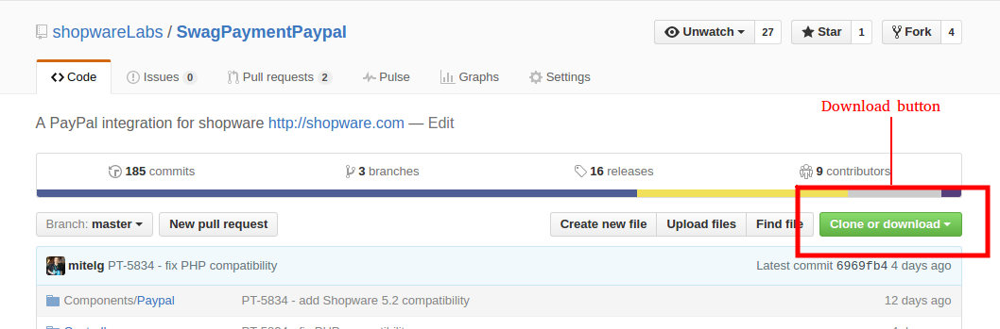
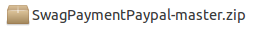

## Introduction
This guide teaches you how to install the Shopware plugins that can be found under <a href="https://github.com/shopwareLabs">GitHub - shopwareLabs</a>.
Step by step it will guide you from downloading the repository from GitHub to the final installation in Shopware.
This guide uses the repository <a href="https://github.com/shopwareLabs/SwagPaymentPaypal">SwagPaymentPaypal</a> as example but except some naming, all the steps should
be valid for any other plugin.

### Step 1 - Downloading the repository
GitHub offers two different ways to download a repository:
- Download as .zip archive
- Download via git tools (git clone)

In this case we will download the archive as .zip without using any git tool.

By clicking the button "Clone or download" (the button that can be seen in the image) a new box expands. Click on "Download ZIP" to start the download.

The file you have downloaded should look similar to this file:

### Step 2 - Preparing the archive
The .zip archive we have downloaded is not compatible to the archive that Shopware requires, therefore we have to rename some things.
Start this process by extracting the archive you've downloaded from GitHub.
A directory called "SwagPaymentPaypal-master" (depending on the plugin you have downloaded) should have been extracted. Simply rename the directory to "SwagPaymentPaypal" (remove the "-master" from the name).

Now we have to create a completely new directory called
- Frontend
- Backend
- Core

depending on the namespace of the plugin.
For SwagPaymentPaypal it's the Frontend namespace.

<blockquote><strong>Hint:</strong> If you don't know the plugin namespace simply open the file "Bootstrap.php" in the root directory of the downloaded plugin.
The syntax is the following: "Shopware_Plugins_<strong>Namespace</strong>_PluginName_Bootstrap". All we need is the namespace part. 
<strong>Example:</strong> <code> class Shopware_Plugins_<strong>Frontend</strong>_SwagPaymentPaypal_Bootstrap</code>
</blockquote>

 Now you should have two folders:
- SwagPaymentPaypal (containing the source files)
- Frontend (empty)

Continue by moving the SwagPaymentPaypal directory into the Frontend directory.

Your directory structure should now be something like this:
**Frontend/SwagPaymentPaypal/**

### Step 3 - Re-creating the archive
Now create a new .zip archive with Frontend as the root directory in it.
It should then look like this:
**SwagPaymentPaypal.zip/Frontend/SwagPaymentPaypal/**

### Step 4 - Uploading the plugin
The archive we have created will be supported for remote upload in the plugin manager.
Upload it as described below:
1. Go to the Shopware backend
2. Open up the Plugin Manager
3. Click on "Installed" on the left side of the manager
4. Click on "Upload plugin" and choose the .zip you have created.
5. Proceed the rest of the plugin installation