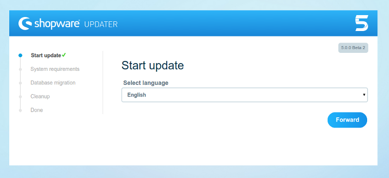
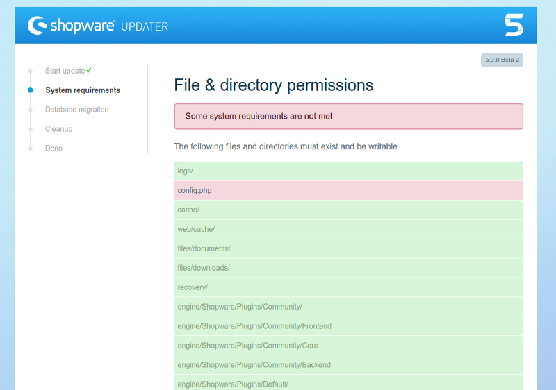
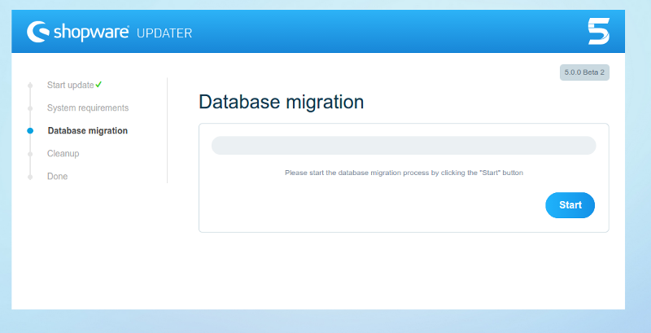
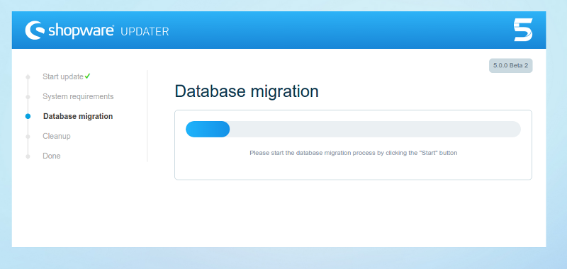
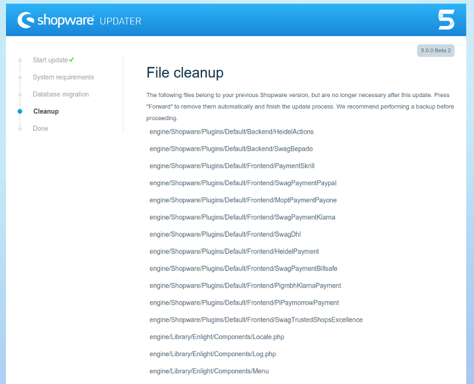
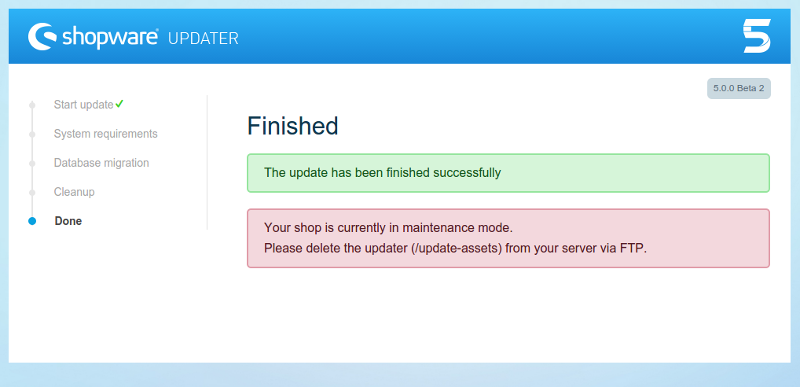

## Updating to Shopware 5

Shopware 5 features a redesigned update tool. If you updated a Shopware installation in the past, you will find this new tool familiar, but will also noticed the improved interface and process. As always, before you start, **backup your files and database**. Also, be sure to test the update process in a test environment prior to attempting it on a production system, to ensure custom and 3rd party plugins are compatible with the new Shopware version.

   <h3>Before you start:</h3>
   
When updating between different major versions, you need to manually check if your system meets all requirements (PHP version, MySQL version, etc). The Shopware Update tool will not check these requirements for you, and starting the update process on an incompatible system may render your Shopware installation unusable.

   
Check the <a href="/developers-guide/shopware-5-upgrade-guide-for-developers/">Shopware 5 Upgrade guide for developers</a> page for more information on system requirements changes from Shopware 4 to 5

In the welcome step, you can choose the language you wish to use during the update process. After that, the update tool will take you to the System requirements step, where it will check that your file system permissions are correctly configured. You might be required to configure them manually.

If your system already has the correct file system permissions, or once you finish configuring them, you will be taken to the database update step

This step will first update your database structure and content, and then update the snippets. It can take a few minutes. A progress bar will indicate the current state for each of the two tasks.

After your database has been updated, the update tool will display a list of Shopware files that are no longer needed. After you confirm, the update tool will attempt to delete them. In case this is not possible, you will be informed, so you can manually delete them later.

Once the update process is finished, you will be asked to manually delete the `/update-assets`. Once you do that, your shop will once again be available.

## Configuring your updated shop

The update process to Shopware 5 will add some features but leave your custom settings unchanged. This means that, for example, your shop now has the new Responsive template included, but it still has your previously selected template configured.

The new Responsive theme is optimized for support in multiple devices, from desktop computers to smartphones and tables, which also impacts the requirements for associated elements, particularly images. However, these settings cannot be changed automatically on update, as they would break your current template. As such, **if you updated from a previous Shopware version and switching to the new Responsive theme**, you need to manually reconfigure some settings on your shop, so it works properly with the new theme.

### Image thumbnails

The new Responsive theme requires different thumbnail sizes for images. It also supports high DPI thumbnails, if available, to improve the end user's experience on devices with high pixel density. As such, you should:

- For each of the following albums, set the following thumbnail sizes. Keep in mind that any other custom thumbnail sizes you might want to have should appear **after** these, not before:

  Album          | Thumbnail sizes
  -------------- | ---------------------------------------------
  Einkaufswelten | 800x800 1280x1280 1920x1920
  Banner         | 800x800 1280x1280 1920x1920
  Artikel        | 200x200 600x600 1280x1280
  Blog           | 200x200 600x600 1280x1280

- Enable High DPI thumbnail generation for all albums that have thumbnail generation enabled.
- Regenerate the thumbnails. We recommend using the `sw:thumbnail:generate` CLI command for this.
- Check your emotion world pages, particularly those depending on thumbnails from the above albums.

As you changed the article thumbnails settings, other parts of your system might also need to be reconfigured to function properly:
- Product export feeds
- Email templates, header and footer

Notice that any custom or 3rd party plugin or template that you might have installed might be affected by this change. We recommend testing these changes before deploying them into production. Also notice that, if you wish to change back from the Responsive theme into a Shopware 4 template, you might need to manually revert all of the above changes.
